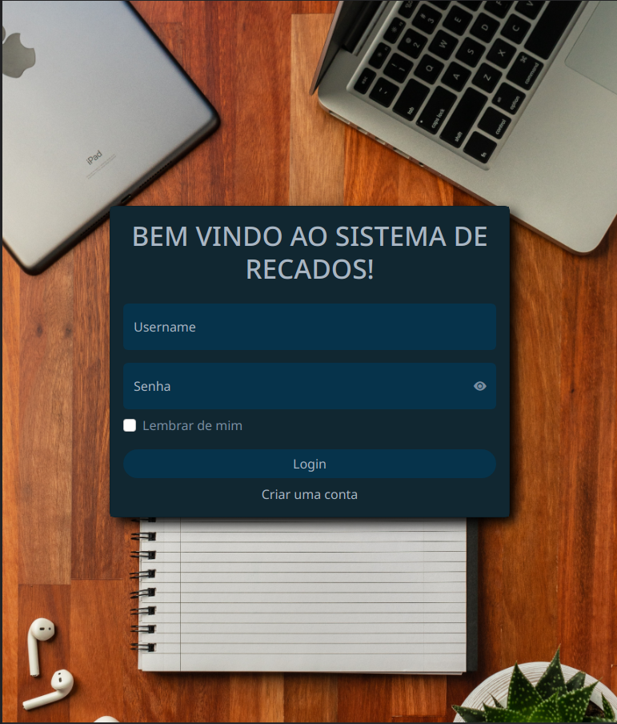
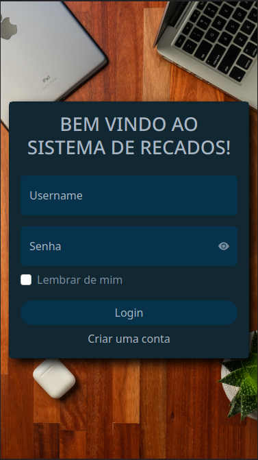
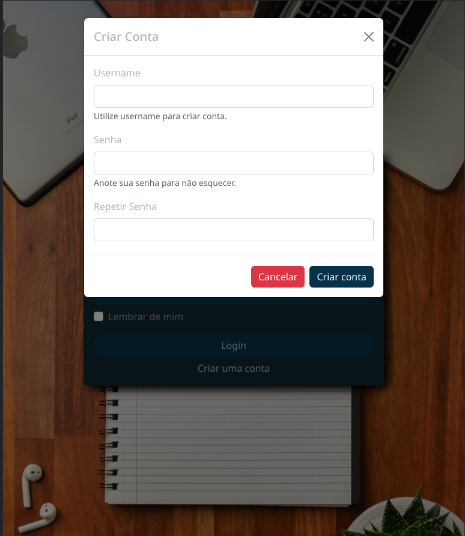
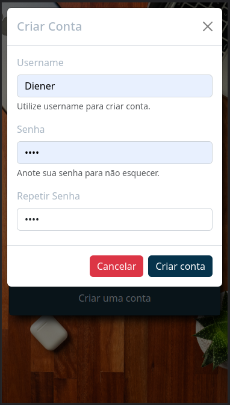
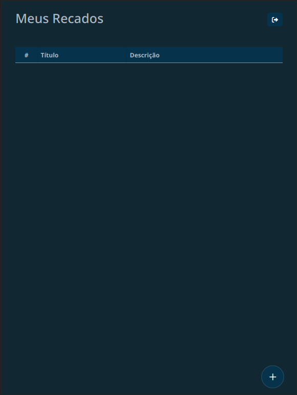
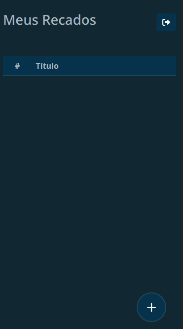
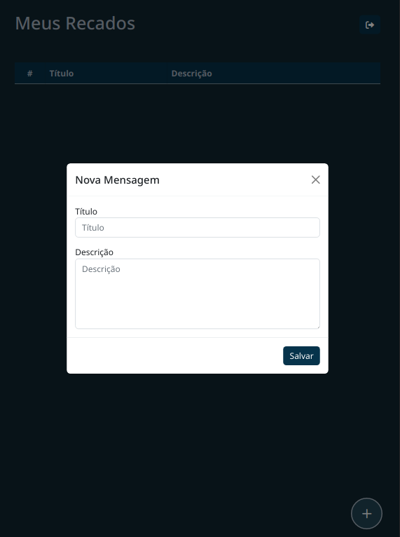
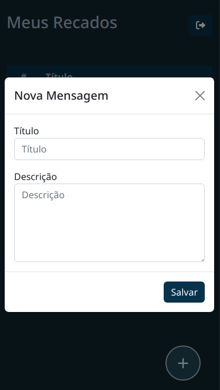
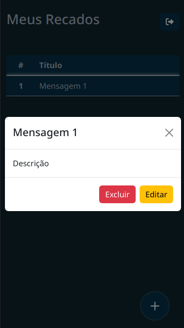

# Trabalho final do modulo front-end 2

## ➡️ Objetivo

Refatorar o código do projeto [**Projeto Anterior**](https://github.com/dienerld/avaliacao-growdev-mod2) usando **Typescript** e **Bootstrap** e aplicar conceitos aprendidos em aula.

## Executar o projeto

```bash
npm install
npm run build
```

## Imagens do projeto

### Telas de login e cadastro

<div style="display: flex">
  <div>
    <h4> Laptop e Desktop </h4>
    
  </div>
  <div>
    <h4> Mobile </h4>
    
  </div>
</div>

<div style="display: flex">
  <div>
    <h4> Laptop e Desktop </h4>
    
  </div>
  <div>
    <h4> Mobile </h4>
    
  </div>
</div>

### Home

<div style="display: flex">
  <div>
    <h4> Laptop e Desktop </h4>
    
  </div>
  <div>
    <h4> Mobile </h4>
    
  </div>
</div>

<div style="display: flex">
  <div>
    <h4> Mobile </h4>
    
  </div>
  <div>
    <h4> Mobile </h4>
    
  </div>
</div>

<div style="display: flex">
  <div>
    <h4> Mobile </h4>
    
  </div>
</div>
